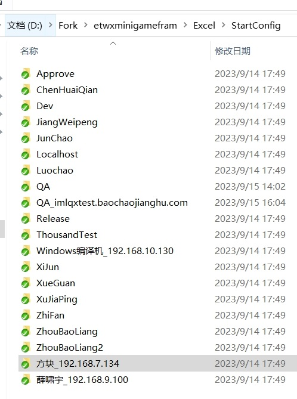
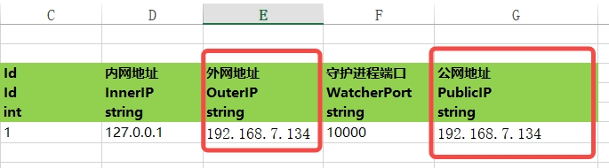
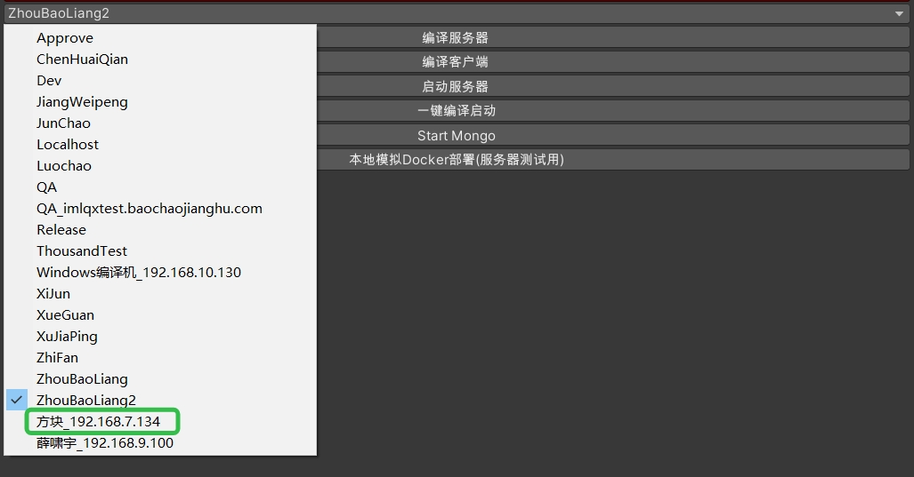
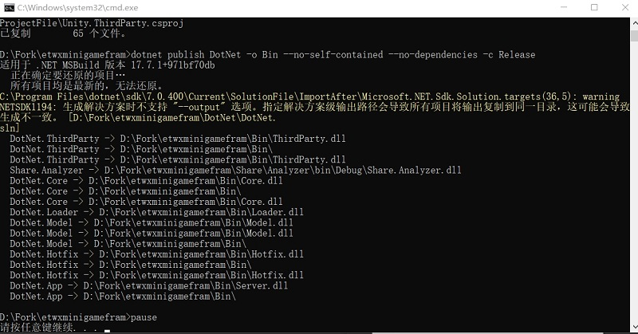
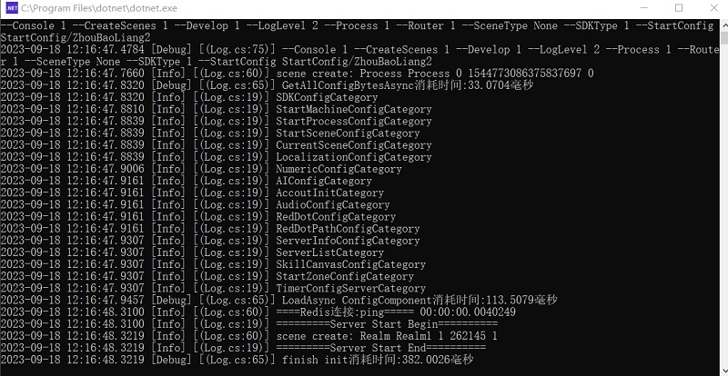

# 新增服务器流程
1. etwxminigamefram\Excel\StartConfig目录下,新增服务器配置
    可以复制ZhouBaoLiang的文件夹,改名字
   
2. 将StartMachineConfig@s.xlsx中的外网地址,公网地址,改成自己的电脑ip地址
   
3. etwxminigamefram\Excel目录下,执行win_startExcelExport.bat `导出配置`
4. etwxminigamefram目录下,执行ETServerOpenPort.bat `开启端口` `一台机器只需执行一次`
5. 在Unity中打得开ET/ServerTools,在下拉菜单中找到自己的服务器,并选中
    
6. 点击编译服务器
    
7. 点击启动服务器
    